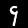
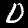
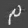

# IHM - Interpretable_DRL
#### Najib EL KHADIR - 11511175
#### Université Lyon 1 - M2 IA 2020/21

### Installation des dépendances (si nécéssaire)
```
pip3 install -r requirements.txt
```

### Code et commentaires
Disponibles dans le fichier :
```
mnist.py
```

### Visualisations des résultats

#### Inputs






#### Merge demo



#### Saliencies


#### States


